## Expertise

- **Full-Stack Web Applications** — Production-ready web applications combining frontend, backend, data and server-side functionality.
- **Dashboards & Admin Interfaces** — Data-driven dashboards, administrative panels and operational interfaces designed for real-world workflows.
- **Backend & API Architecture** — REST APIs, authentication, business logic, relational data and system integrations.
- **Automation & Integrations** — Workflow automation, webhooks, external services and business process integrations.
- **Infrastructure & Production** — Dockerized environments, Linux servers, reverse proxies, deployment workflows and production operations.

 

## Tech Stack

### Languages

  

### Frontend & UI

       

### Backend

  

### Data

  

### Data Visualization

### Infrastructure & DevOps

    

### Testing & Tooling

    

### Integrations

    

 

## Current Focus

- Building and evolving full-stack web applications and internal business systems.
- Designing data-driven dashboards, admin panels and operational interfaces.
- Strengthening backend architecture, REST APIs, security and system integrations.
- Improving production workflows with Docker, Linux, automation and testing.

 

---

Building reliable software with clarity, precision and long-term maintainability.

